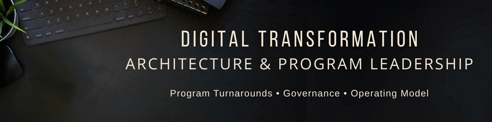

<div align="center">



<br />
<br />

# 👋 Hi, I'm Guido Nicolás Quadrini

### Technology Leader · Enterprise Architect · AI & Platform Builder


I help teams turn complex technology, architecture and delivery challenges into systems that work in the real world.

📍 Oslo, Norway · 🌍 EU Citizen  
🏗️ Enterprise Architecture · Digital Transformation · Program Leadership · Cloud · DevOps · AI Agents

<br />

[](https://guidoquadrini.com)
[](https://www.linkedin.com/in/guidoquadrini/)
[](mailto:guido.quadrini@gmail.com)

<br />

<a href="https://www.buymeacoffee.com/matekraft">
  
</a>

</div>

---

## About me

I'm a senior technology and digital transformation leader with **16+ years of experience** across telecom, pharma, public sector, healthcare, education and consulting.

I started close to the code as a full-stack developer and evolved into architecture, platform leadership, governance, transformation and delivery leadership roles.

That path shaped how I work today:

- strategic enough to align roadmaps, operating models and priorities;
- technical enough to understand systems, trade-offs and engineering reality;
- practical enough to help teams deliver under real constraints.

I care about building technology that is **reliable enough to trust, simple enough to operate, clear enough to evolve and useful enough to matter**.

---

## Executive snapshot

| Signal | Evidence |
|---|---|
| **16+ years** | Technology, architecture, delivery and transformation across telecom, pharma, public sector and healthcare. |
| **Architecture at scale** | Digital channels, platform governance, NFRs, ADRs, integration patterns and architecture roadmaps. |
| **Measurable outcomes** | ~40% IT cost reduction, ~20% lower cloud/CO₂ footprint and ~60% faster onboarding through harmonization and standardization. |
| **Regulated delivery** | GxP systems, validation, traceability, audit-ready documentation and risk-based delivery. |
| **Hands-on roots** | Full-stack development, systems engineering, cloud, infrastructure, DevOps and operational reliability. |

---

## What I do

```txt
Strategy → Architecture → Delivery → Reliability → Automation → Learning
```

I work at the intersection of:

- Enterprise, solution and domain architecture
- Digital transformation and operating models
- Project, program and portfolio leadership
- Platform engineering and developer experience
- Cloud and infrastructure modernization
- DevOps, DevSecOps and SRE practices
- AI agents, workflow automation and AI-assisted delivery
- Technical coaching and team enablement

My sweet spot is helping organizations move from complexity, fragmentation and uncertainty into clearer systems, better decisions and measurable outcomes.

---

## `whoami`

```yaml
name: Guido Nicolás Quadrini
location: Oslo, Norway
role:
  - Technology Leader
  - Enterprise & Solution Architect
  - Program / Project Leader
  - AI & Platform Builder

current_focus:
  - AI agents for real workflows
  - architecture governance that enables delivery
  - platform thinking and developer experience
  - cloud-native reliability
  - responsible automation

working_style:
  - strategic but practical
  - technical but human-centered
  - structured but not bureaucratic
  - delivery-focused without ignoring risk
```

---

## What I bring

| Capability | What it means in practice |
|---|---|
| 🏗️ **Architecture clarity** | Enterprise, solution and domain architecture for complex systems, platforms and operating models. |
| 🚀 **Delivery discipline** | Program, project and portfolio leadership with governance, risk control and measurable outcomes. |
| 🤖 **AI & automation pragmatism** | AI agents, workflow automation and AI-assisted delivery with accountability and control. |

---

## Current focus

```yaml
currently_building_and_exploring:
  - AI agents for workflow automation
  - AI-assisted software delivery
  - developer experience and platform thinking
  - architecture governance without unnecessary bureaucracy
  - observability-first systems
  - responsible automation
  - cloud-native platforms
  - human-centered digital transformation
  - technology leadership in complex environments
```

---

## AI, Agents & Automation

I'm interested in how AI agents and automation can improve real delivery work — not just demos.

Areas I care about:

- AI agents for repetitive operational workflows
- software delivery copilots
- documentation and knowledge retrieval
- incident triage and root-cause assistance
- architecture decision support
- automated checks, reviews and delivery guardrails
- practical AI adoption with accountability and governance

I like AI when it helps people make better decisions, reduce friction and move faster without losing control.

---

## Tech Stack

### Currently using / actively working with


### Architecture, Strategy & Governance


### Project, Program & Delivery Leadership


### Cloud, DevOps & Reliability


### Data, Integration & Security


### Real-world experience with


---

## Selected builds & themes

| Area | What I'm building / exploring |
|---|---|
| **AI Agents** | Workflow automation, delivery copilots, document intelligence, operational assistants and decision-support tools. |
| **Architecture Toolkit** | Practical patterns for ADRs, NFRs, capability mapping, architecture governance and platform modernization. |
| **Homelab & Automation** | Linux-based infrastructure, local services, observability, networking, self-hosting and home automation. |
| **Developer Experience** | Better documentation, reusable templates, CI/CD practices and systems that reduce team friction. |
| **Digital Transformation** | Operating models, delivery recovery, governance structures and business/technology alignment. |

---

## Selected experience

### Telia Norge

**Digital Channels · Architecture · Platform Governance · AI in SDLC**

Led architecture alignment and transformation initiatives across digital channels and internal platforms, with focus on roadmaps, standards, NFRs, ADRs, cloud optimization, observability, privacy and accessibility by design, and pragmatic AI adoption in delivery workflows.

### Cognizant

**Regulated Delivery · Pharma · GxP Systems · Risk-Based Execution**

Managed technology delivery in regulated pharma environments, including QMS, LMS, manufacturing systems, validation, traceability, documentation discipline, stakeholder alignment and delivery governance.

### Eurogroup

**Infrastructure Modernization · Hybrid Cloud · Security · ITSM**

Led infrastructure, cloud, identity, networking, security, SAP migration, telephony modernization, ITSM adoption and operational improvement across multi-country environments.

### WHO / PAHO & Public Health

**Health Platforms · Traceability · Real-World Adoption**

Designed and delivered public health systems supporting clinical workflows, blood-bank traceability, ethics committee management, equipment integration and multi-institutional rollout.

---

## GitHub Stats

<div align="center">

<a href="https://github.com/akasha-code">
  
</a>

<a href="https://github.com/akasha-code">
  
</a>

</div>

---

## How I think

```txt
Good architecture is not decoration.
It is a decision system.

Good delivery is not motion.
It is progress with control.

Good automation is not replacing people.
It is removing friction from the work that matters.

Good leadership is not having all the answers.
It is creating the conditions for better decisions.
```

---

## Beyond work

When I'm not working with systems, teams or technology, I'm probably training judo, fishing, camping, experimenting with electronics, automating something at home, cooking or drinking mate while thinking about the next idea.

---

## Languages

| Language | Level |
|---|---|
| Spanish | Native |
| English | Fluent / C1 |
| Norwegian | B1, actively improving |
| Italian | Basic conversational |

---

<div align="center">

## Let's start with a meaningful conversation

I help teams create clarity in complex technology and delivery environments.  
If you're building something that matters, let's talk.

A short note is enough. I'll take it from there.

<br />

[](https://tally.so/r/J929pK)
[](https://guidoquadrini.com)
[](https://www.linkedin.com/in/guidoquadrini/)
[](mailto:guido.quadrini@gmail.com)

<br />
<br />

<table>
  <tr>
    <td align="center">
      <a href="https://www.buymeacoffee.com/matekraft">
        
      </a>
      <br />
      <strong>Support MateKraft</strong>
      <br />
      <sub>Buy me a coffee if my work helped you.</sub>
    </td>
  </tr>
</table>

<br />
<br />


</div>
